#  **cBooking** Development Report 

Welcome to the documentation pages of **cBooking**.

This project consists of the development of a small dynamic website, using the technologies studied during Systems Engineering Software.

You can find here detailed documentation about **cBooking**:

  * [Product Vision](#Product-Vision)
  * [Description of the Topic](#Description-of-the-topic)
  * [UML Classes Diagram](#UML-Classes-Diagram)
  * [Relational Model of the Database](#Relational-Model-of-the-Database)
  * [User Stories](#User-Stories)
  * [UI Mockups](#UI-Mockups)
  * [Implemented Features and Demonstration](#Implemented-Features-and-Demonstration) 
  * [Project Management](#Project-Management)

The most recent versions of Topic Description, UML Classes Diagram, and Relational Model of the Database are updated here.

## Product Vision
Most event organizers are faced with the need to work with loads of different technologies for the management of people and entities who participate in their events. **cBooking** gathers it all in a single plataform, providing the organizer with tools to register, track and manage whoever is going to participante in their event.

## Description of the Topic
A tech company wants to create a platform to automate the management of conferences. The platform is expected to announce events and support the logistics of conferences, by allowing the registration of organizers, participants, speakers, partners, sponsors and staff. Taking these features in consideration, the company elaborated the following list of requirements:

* The website must have a public interface, for announcement of events and registration, and a private one, exclusive for the event organizer and staff members, for management of the conference.
    
* The private interface, for organizers and staff, which must display relevant data, such as payments tracking, and lists of participants, speakers, staff, sponsors, partners, as well as event management settings.

* Each organizer can create as many events as wished. 

* Each **event** must have an organizer, name, dates, location, theme. An image and text for description can also exist. A unique identifying number should be given to each event, as well as a unique code for registration of Speakers, Partners, and Staff.

* If existent, the maximum number of participants must be higher than the (current) number of participants.

* The event can have as many registration packages as wished, for participants, sponsors, and partners

* Each **participant package** must be associated with an existing event, and have a unique name, price, and features. A maximum number of participants per package is optional.

* Each **sponsor package** must be associated with an existing event, and have a unique name, range of financial support (minimum and maximum values), and associated perks.

* Each **partner package** must be associated with an existing event, and have a unique name and associated perks.

* When it comes to registration, there are 4 different roles for **persons**: organizer, participant, speaker, and staff. Each person must have a unique identifying number, name, email, and phone number.

* For the registration of supportive entities, there are 2 types of **entity**: sponsor and partner. Each entity must have a unique identifying number, name, logotype. A website link may be inserted.

* Additionally, each:

    * **organizer** must have a name, email, password, address, and VAT number. A logotype is optional. A unique identifying number should be generated to each one of them.

    * **participant** must be associated with an existing event and have an address, a VAT number, and a chosen package. If the event is paid, a payment validation status attribute is created, set not paid as default.

    * **speaker** must be associated with an existing event and have a title, profile picture, subject of talk, and abstract.

    * **staff** member must be associated with an existing event and have a department and a password. A profile picture is optional. 

    * **sponsor**  must be associated with an existing event, have a chosen package, a financial amount of support, and a payment validation status (initialized as not paid). The financial amount of support must be according to the chosen package.

    * **partner** must be associated with an existing event, have a chosen package, and a support type.

* Upon registering in an event, each speaker, partner and staff member will have to insert a pre-defined and exclusive code, according to the role, provided by the organizer.

* If an event is deleted, all the associated classes must be deleted too, except the organizer.

* The public announcement of the event should include a list of speakers, staff, validated sponsors and partners, as well as the date, location, available registration packages, and responsible organizer.

* As an extra, it would be nice to have a public interface with a search feature implemented, with the possibility of looking for all existing events, sorted by name and location, ordered by price range.

## UML Classes Diagram

The editable diagram can be found [here](https://app.diagrams.net/?fbclid=IwAR1a7G6Dzc8LV772jwXzXuobzEi9GBw6hw7QulK5O39BuPO0flrY2Vo14QI#Hjoamats%2FProjetoESIN%2Fmain%2Fdocs%2Fdrawio%2FUML%20Classes).

# Relational Model of the Database

**Organizer**(<ins>ID_num</ins> -> Person, password, logotype, address, VAT_num)

NOT NULL (password)

NOT NULL (address)

NOT NULL (VAT_num)

---

**Event**(<ins>ID_num</ins>, name, date_start, date_end, local, aboutEvent, theme, image, codeForSpeakers, codeForStaff, codeForPartners, organizer -> Organizer)

NOT NULL (name)

NOT NULL (date_start)

NOT NULL (date_end)

NOT NULL (local)

NOT NULL (theme)

NOT NULL (organizer)

UNIQUE (codeForSpeakers)

UNIQUE (codeForStaff)

UNIQUE (codeForPartners)

---

**ParticipantPackage**(<ins>name</ins>, <ins>event</ins> -> Event, price, features, maxNum_participants)

NOT NULL (price)

NOT NULL (features)

---

**PartnerPackage**(<ins>name</ins>, <ins>event</ins> -> Event, perks)

NOT NULL (perks)

---

**SponsorPackage**(<ins>name</ins>, <ins>event</ins> -> Event, financialSupport_range_min, financialSupport_range_max, perks)

NOT NULL (financialSupport_range_min)

NOT NULL (financialSupport_range_max) 

NOT NULL (perks)

CHECK (financialSupport_range_min < financialSupport_range_max)

---

**Person**(<ins>ID_num</ins>, name, email, phone_num)

NOT NULL (name) 

NOT NULL (email)

NOT NULL (phone_num)

---

**Participant**(<ins>ID_num</ins> -> Person, address, VAT_num, paymentValidation_status, package -> ParticipantPackage, event -> ParticipantPackage)

NOT NULL (address)

NOT NULL (VAT_num) 

NOT NULL (package)

NOT NULL (event)

DEFAULT (paymentValidation_status = ‘not paid’)

---

**Speaker** (<ins>ID_num</ins> -> Person,  event -> Event, title, profile_pic, talk_subject, talk_abstract)

NOT NULL (event)

NOT NULL (talk_subject)

---

**Staff** (<ins>ID_num</ins> -> Person, event -> Event, profile_pic, department, password)

NOT NULL (event)

NOT NULL (department)

NOT NULL (password)

---

**Entity** (<ins>ID_num</ins>, email, name, logotype, website_link)

NOT NULL (name)

NOT NULL (email)

---

**Sponsor** (<ins>ID_num</ins> -> Entity, financialSupport_amount, paymentValidation_status, package -> SponsorPackage, event -> SponsorPackage)

NOT NULL (financialSupport_amount)

NOT NULL (paymentValidation_status),

NOT NULL (package)

NOT NULL (event)

CHECK(financialSupport_amount > 0)

DEFAULT ( paymentValidation_status = ‘not paid’)

---

**Partner**(<ins>ID_num</ins> -> Entity, supportType, package -> PartnerPackage, event -> PartnerPackage)

NOT NULL (supportType)

NOT NULL (package)

NOT NULL (event)

---

## User Stories

| Description |  Importance | Effort |
| :------------- | :----------: | :-----------: |
| As a cBooking user, I want to see the details about each event, namely date, location, available registration packages, featured speakers, staff, validated sponsors and partners, so that I can be better informed. | Must Have | XL | 
| As a cBooking user, I want to see all the existing events, so that I can register in the ones I am interested in. | Must Have | XL |
| As a cBooking user, I want to be able to select the role I will take in an event, so that I am treated accordingly to my role in the event, and I can provide the event organizer with relevant information. | Must Have | M |
| As an organizer, I want to be able to announce  my event, defining all the details for it, so that whoever will be involved in it can register himself. | Must Have | L | 
| As an organizer, I want to be able to define registration packages for participants, sponsors and partners, so that different prices, features and perks can be applied to different persons or entities. | Must Have | S |
| As an organizer, I want Speakers, Partners and Staff to enter a code (provided by the organization), upon registration, so that only authorized persons and entities can register in my event. | Should have | S |
| As a cBooking user, I want to search events, sorted by a specific detail, so that I can easily find events that I like. | Should have | S | 
| As an organizer, I want to be able to validate the payment of sponsors, so that they are automatically added to the public details of the event. | Should have | M |

## UI Mockups

User Interface Mockups were developed to plan the website's design, using Adobe XD.

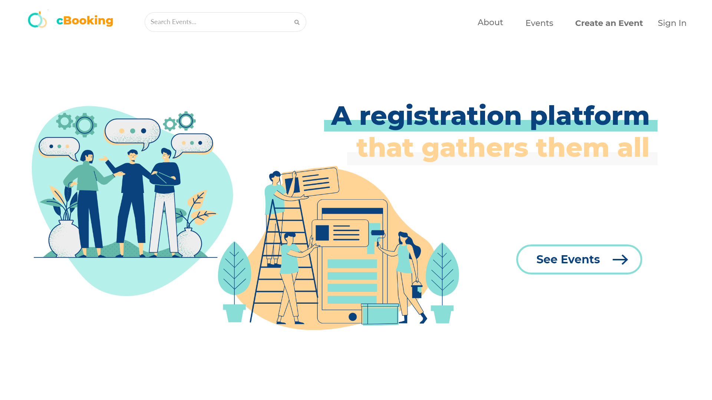

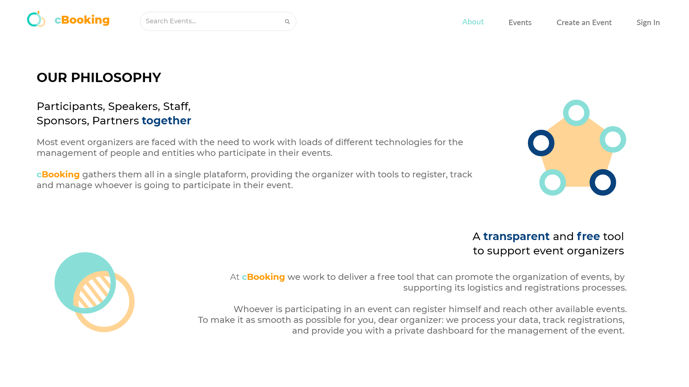

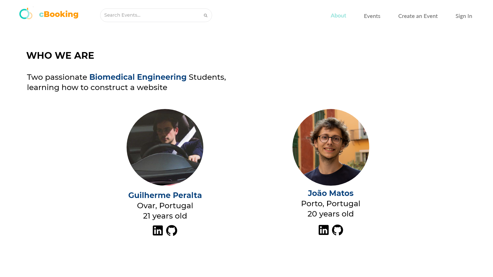

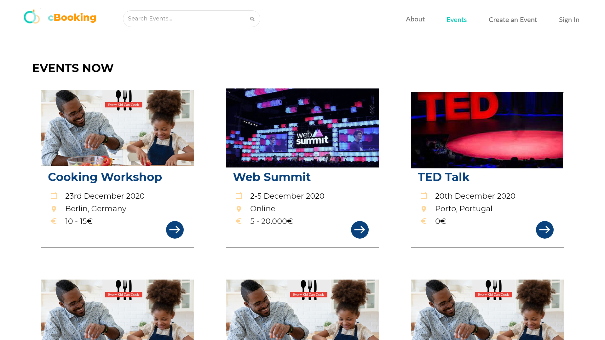

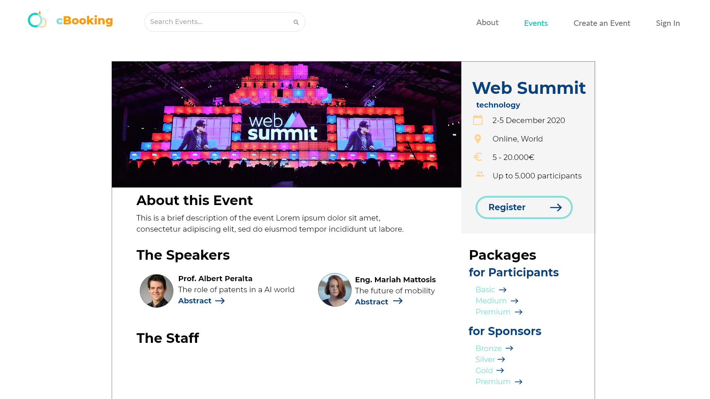

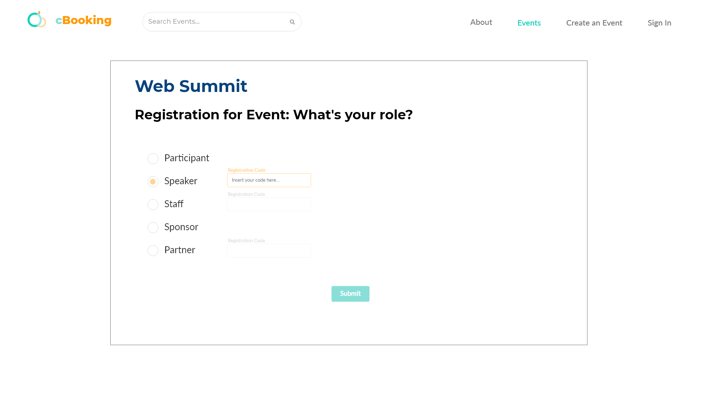

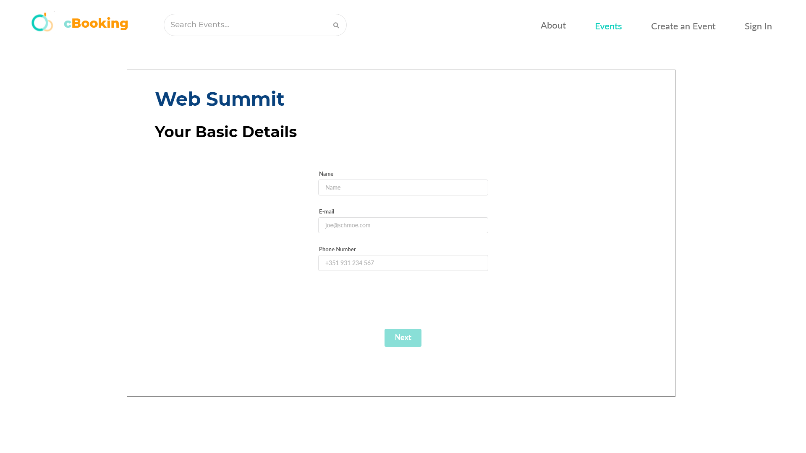

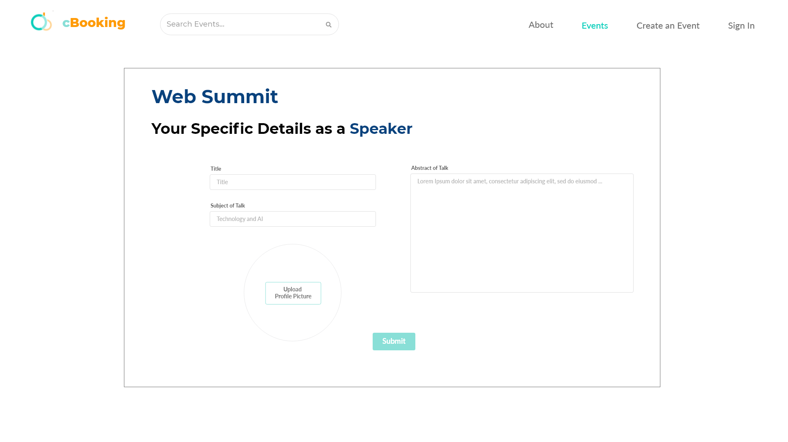

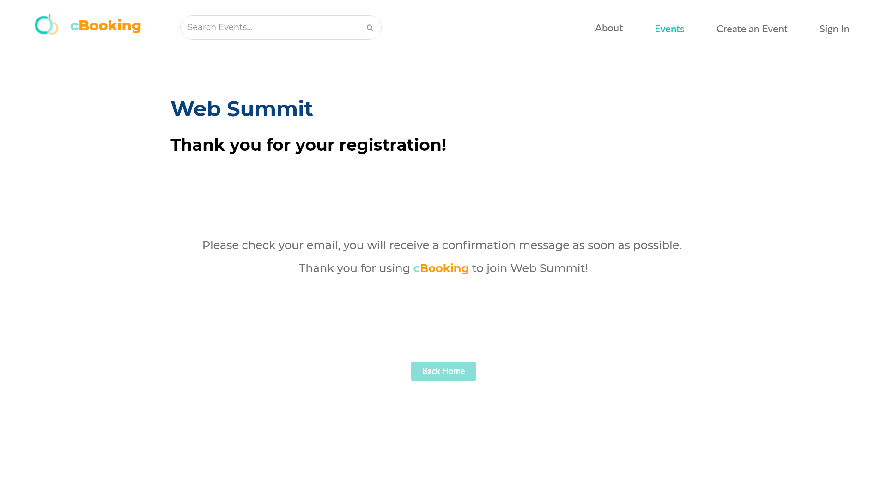

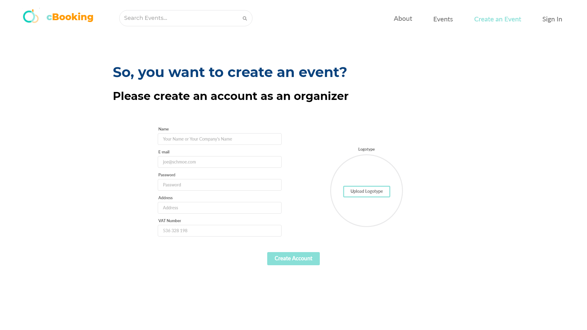

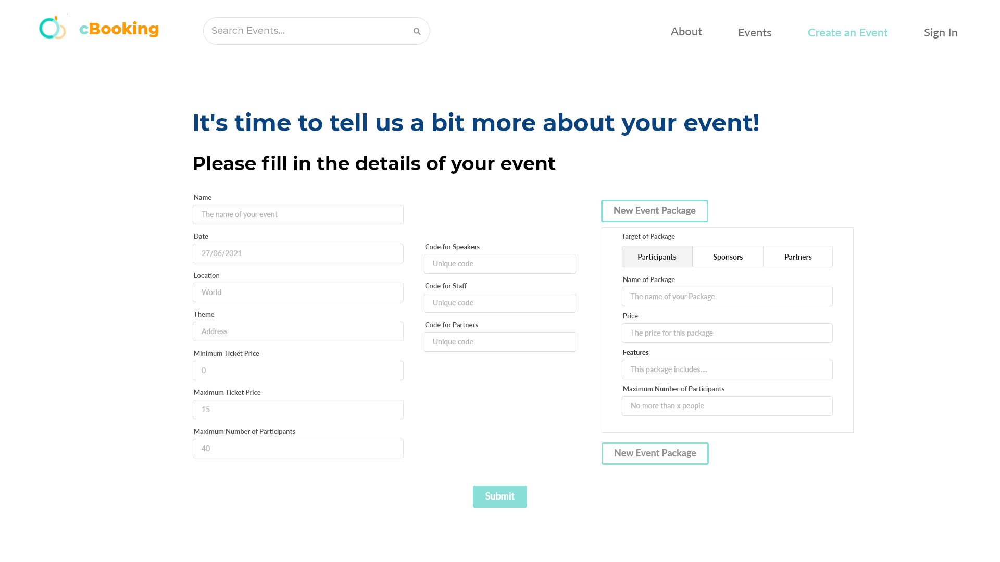

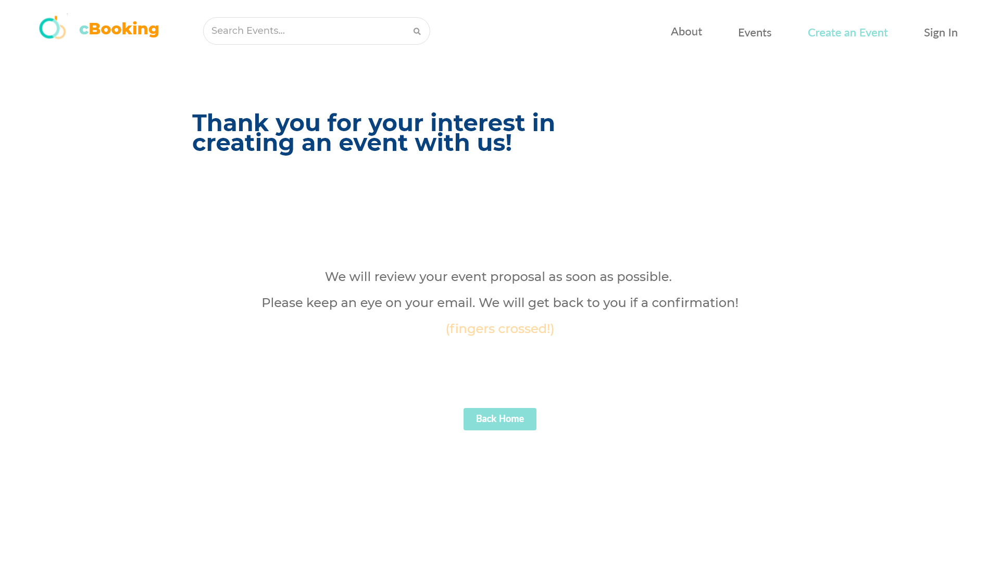

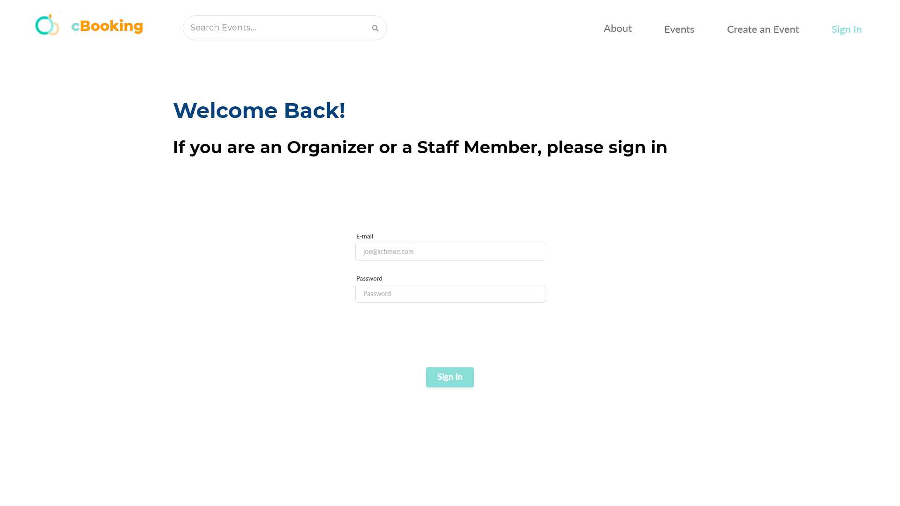

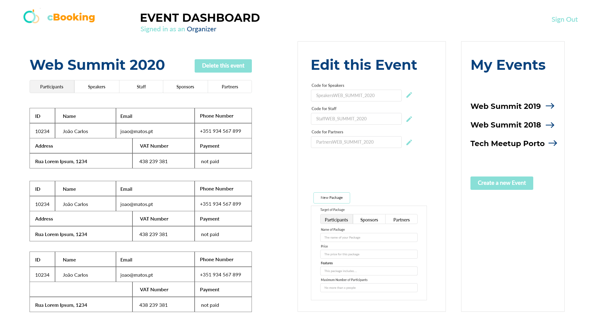

## Implemented Features and Demonstration

* General overview website (index, about, all pages)
* See all the existing events
  * Sort by date
  * Search by name of event and location
  * Pagination with user-defined number of pages
* See event details
  * Speakers and Packages detailed info
  * Sponsors  and Partners external hyperlink
* Registration in event according to role
  * 5 existing roles, according to existing packages
  * Access codes for Speakers, Staff, Partners
  * Input check and use of required fields
    * Sponsors' financial support
    * Staff's unique emails
    * Format of fields (email, phone number, VAT number)
  * Upload of images 
    * Size and format verification
    * New name for each image
* Registration of an organizer (unique email)
* Login of an organizer or staff, and Logout
  * Differentiated tools
  * Security precautions
    * Access by url without login
    * Access other people's events
* Create an Event
* Manage My Events (Organizer)
  * See all events organized by me
  * Event Info Synthesis
  * Create and delete Package
    * Verifcation of unique name (inside the event)
    * Verifcation of support range (sponsors)
  * Edit event details and image
  * View and Reset access codes
  * Lists of all different roles
    * Delete Options
    * Change Payment Status (making Sponsors (in)visible)
  * Info Visualization mode
  * Delete event

## Project Management

The flow of work of this project is being done with the tool GitHub Projects. The board with tasks can be found [here](https://github.com/joamats/ProjetoESIN/projects/1).